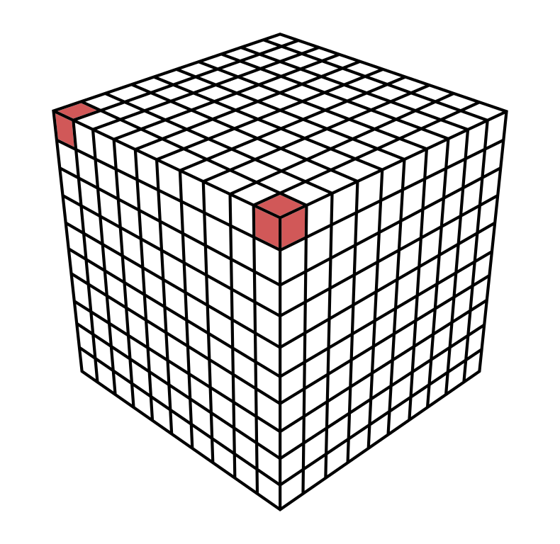
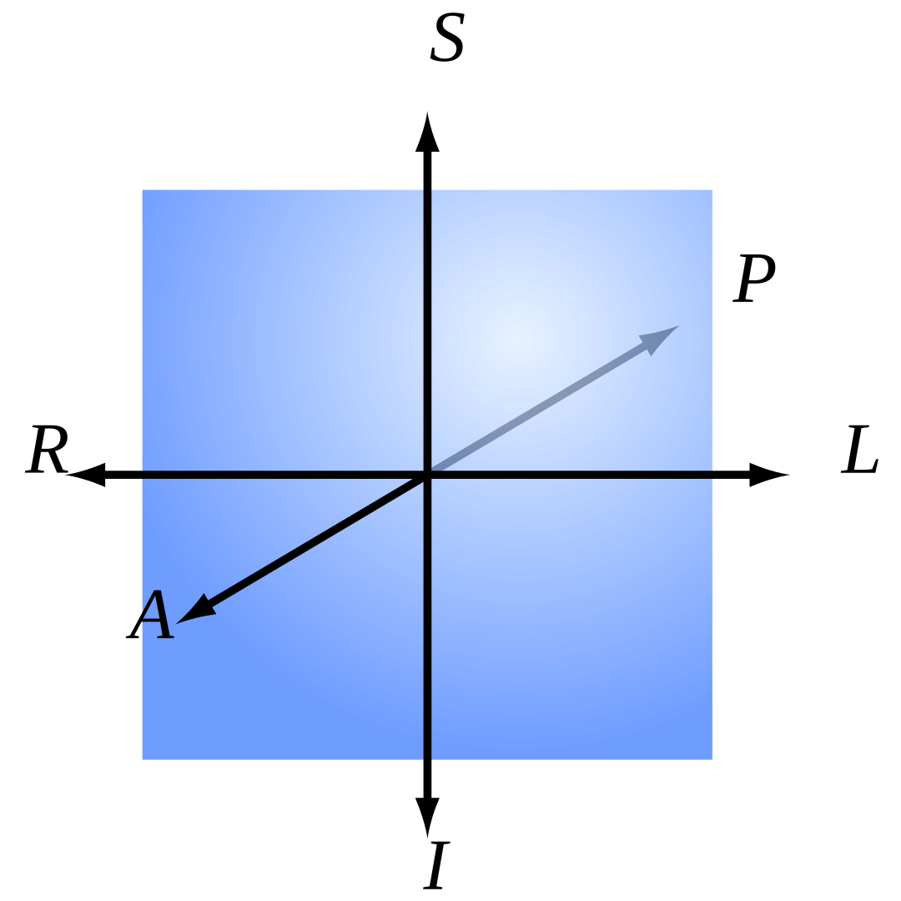
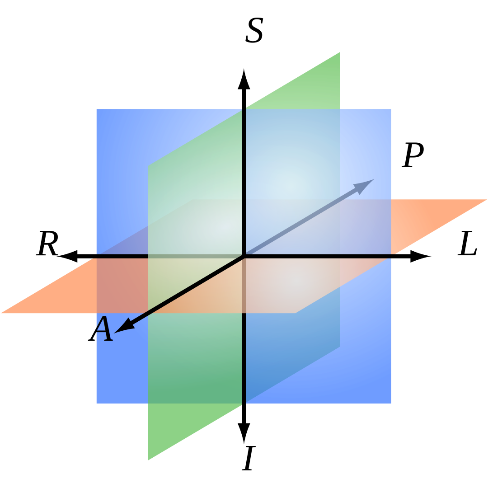

# About Volume Data

## 3D Images and Voxels

A voxel is like a three-dimensional pixel that represents a value on a regular grid in three-dimensional space. It is analogous to a pixel, which represents a value on a regular two-dimensional space, like a 2D image.

|  
| :--------------------------------------:
| _3D voxel grid with two highlighted voxel_

When dealing with 3D MRI or 3D CT images, a voxel value usually represents a itensity value (also known as ISO value).

## Orientation and Voxel-Order Terminology

### Basic Direction Terms

**Directions are given relative to the patient or object.** ("Right" is patient's or object's right.) When referring to a location on a screen, it is important to be precise. For instance, patient-right can be located on the left side of the screen. We use the following terms:

Directions                     | Example
------------------------------ | ---------------------------------------------
**R**ight <-> **L**eft         | Patient's right ear <-> patient's left ear
**A**nterior <-> **P**osterior | Patient's nose <-> patient's back of the head
**I**nferior <-> **S**uperior  | Patient's jaw <-> patient's skullcap

 | 
-------------------------------------------------------- | ----------------------------------
3D Coordinate System                                     | Head Reference

> The terms **"up", "down", "front", "back"** are not used because they have ambiguous meanings when dealing with patients in different orientations (e.g. lying down).

### Axes for Spatial Coordinates

To describe locations in space around volume data, we need to agree on a specific set of axes. These axes are used to describe a point's coordinates. There are three axes that could be used in any order, and either direction could be positive. This gives us a total of 48 possible axis schemes.

It seems that three of these schemes are most popular:

|        |        |        |                           |
|--------|--------------------------|--------------------------|--------------------------|
|**RAS** ("Neurological" convention) +X = R +Y = A +Z = S|**LAS** ("Radiological" convention) +X = L +Y = A +Z = S|**LSA** ("Math" convention) +X = L +Y = S +Z = A|Head Reference|

> **Viewing Direction:** The figures above are shown as viewed looking toward the patient’s face. However, there are also conventions for viewing, such as the neurological view, which is from above/behind the patient and shows patient left on screen left.

The RAS coordinate system is a right-hand coordinate system (thumb = R, 2nd finger = A, middle finger = S.). On the other hand, LAS is a left-hand coordinate system.

The L, A and S axes could provide a right-hand coordinate system if used in the order LSA for example. A right-hand coordinate system is customarily used when performing matrix and vector math and is more attractive for computer graphics developers and APIs. This is why VDS uses LSA internally. However, it seems like no one uses LSA when talking about volume data in a medical context. Therefore you can view volume data in various different coordinate systems (RAS, LAS, LSA).

### Planes for Volume Slice Orientation

There are three commonly used slice planes:

- Axial (Transverse): R-L x A-P plane
- Coronal: R-L x S-I plane
- Sagittal: A-P x S-I plane

The viewing direction on each plane depends on the axis convention used, such as **RAS**, **LAS**, or **LSA**.

 |  |  |  | 
------------------------------------------------------------------------------- | ----------------------------------------------------------------------------------- | ------------------------------------------------------------------------------------- | ------------------------------------------------------------------------------- | ----------------------------------
Axial (Traverse)                                                                | Coronal                                                                             | Sagittal                                                                              | All Planes                                                                      | Head Reference

## Volume Data Representation in VDS

VDS maps intensity values internally to a floating point range of 0.0 to 1.0 with a 16 bit presicion, where 0.0 represents the lowest possible intensity value and 1.0 represents the highest possible intensity value.

## Great Resources

In case you are interested in more information about volume data, you may also be interested in reading the following articles:

- [Orientation and Voxel-Order Terminology: RAS, LAS, LPI, RPI, XYZ and All That](http://www.grahamwideman.com/gw/brain/orientation/orientterms.htm) by Graham Wideman
- [AFNI Documentation](https://afni.nimh.nih.gov/pub/dist/doc/htmldoc/index.html) is a set of free and open source, which specalized on human brain MRI scans and is way more advanced than VDS. Its documentation goes way more in depth on various volume data information.
