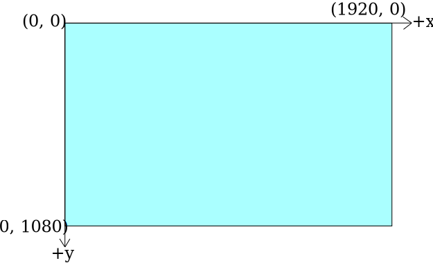
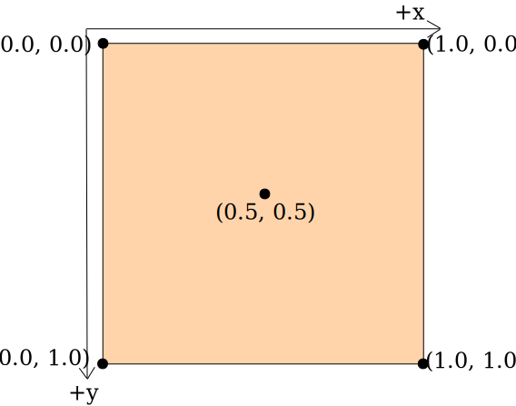

# Render Backend

VDS uses the [wgpu](https://wgpu.rs/) graphics API to render all visualizations. Shaders are written in the [WebGPU Shading Language](https://gpuweb.github.io/gpuweb/wgsl/) also known as `WGSL` and can be translated to various native graphics APIs like Vulkan, DirectX or Metal. This is why VDS supports so many different plattforms listed on [Supported Plattforms](/supported_plattforms.html).

## wgpu Coordinate System

Since all graphics pipelines are written with wgpu and WGSL, the underlying [coordinate system is the one from WebGPU](https://www.w3.org/TR/webgpu/#coordinate-systems), which is identical to the coordinate system of DirectX and Metal.

> Note: All custom shaders must be compliant with the WebGPU coordinate system, no matter which graphic API backend is used by the plattform. All coordinates will be transformed by wgpu to match the plattform graphics API coordinate system. So do not assume the coordinate system of for example Vulkan when VDS uses Vulkan as render backend.

### Normalized device coordinate system

Normalized device coordinates use a `left-handed coordinate system` and map to positions in the viewport. These coordinates are independent of viewport size. The bottom-left corner is at (-1.0, -1.0, z). Positive-z values point away from the camera ("into the screen") and are clipped between 0.0 and 1.0.

|  
| :--------------------------------------:
| _Normalized device coordinate system_

### Framebuffer coordinate system

Framebuffer coordinates adress pixels in the framebuffer and have two dimensions (x, y). Those dimensions are not normalized, so each pixel extends 1 unit in x and y dimensions. The top-left corner is at (0, 0).

|  
| :--------------------------------------:
| _Framebuffer coordinate system_

### 2D Texture Coordinates

2D textures us a normalized coordinate system. The origin of a 2D texture is a the top-left corner with +Y facing down. Sometimes uv coordinates are used to describe a texture coordinate, where (u, v) is equal to (x, y).

|  
| :--------------------------------------:
| _2D texture coordinates_

### 3D Texture Coordinates

3D textures us a normalized coordinate system. The origin of a 3D texture is a the top-left-front corner with +Y facing down and +Z facing back, similiar to [DirectX 11](https://learn.microsoft.com/en-us/windows/win32/direct3d11/overviews-direct3d-11-resources-textures-intro#3d-textures
). Sometimes uvw coordinates are used to describe a texture coordinate, where (u, v, w) is equal to (x, y, z).

## Differnces to other APIs like OpenGL and Vulkan

Other graphics APIs like OpenGL and Vulkan use different coordinate systems. This section aims to highlight the differences between those coordinate systems to mitigate misunderstandings.

### WebGPU & DirectX & Metal
**NDC:** +Y is up. Point (-1, -1) is at the bottom left corner.\
**Framebuffer coordinates:** +Y is down. Origin (0, 0) is at the top left corner.\
**2D Texture coordinates:** +Y is down. Origin (0, 0) is at the top left corner.

### OpenGL & OpenGL ES & WebGL
**NDC:** +Y is up. Point (-1, -1) is at the bottom left corner.\
**Framebuffer coordinates:** +Y is up. Origin (0, 0) is at the bottom left corner.\
**2D Texture coordinates:** +Y is up. Origin (0, 0) is at the bottom left corner.

### Vulkan
**NDC:** +Y is down. Point (-1, -1) is at the top left corner.\
**Framebuffer coordinates:** +Y is down. Origin (0, 0) is at the bottom left corner.\
**2D Texture coordinates:** +Y is up. Origin (0, 0) is at the bottom left corner.

## 3D Volume Scaling

VDS only supports uniform and non-uniform volume data that is represented as a regular grid of voxels. This means, that each that the distance between all voxels must be identical on the same axis.

<!-- TODO: include visual examples here -->

Not supported a irregular or non-linear distance between voxels along either axis.

During the import process, the bounding box of the volume data is normalized. This means, that aspect ratio of the volume is applied to the bounding box and afterwards the volume gets scaled in a way, that the longest side of the bounding box equals a length of 1.0.

## Z-Values and Depth Buffer

`Z-Values` represent the distance of a pixel from the camera in projection coordinates. The near clipping plane is set to **0.1** and the far clipping plane is set to **10.0** which results in a in far-plane/near-plane ratio of 100. At a ratio of 100, 90 percent of the precision range is spent on the first 10 percent of the depth range ([D3D Docs](https://learn.microsoft.com/en-us/windows/win32/direct3d9/depth-buffers)). This is suitable for all volume renderers of VDS, since the bounding box of the volume data is always normalized due to the [3D Volume Scaling](#3d-volume-scaling).

The `Depth Buffer` contains depth values between 0.0 and 1.0, where 0.0 is the closest distance and 1.0 is the furthest distance. All Z-Values get mapped from the range of the near-plane - far-plane to the range of 0.0 - 1.0 respectively. VDS uses [wgpu::TextureFormat::Depth32Float](https://docs.rs/wgpu/latest/wgpu/enum.TextureFormat.html#variant.Depth32Float) for the depth buffer.

### Depth Buffer and Ray Marching

The depth of each pixel is set to first sample point the ray that exceeds the threshold value.

For non-translusent visualization methods like "First Hit" the depth value is set accordingly to the visible surface shown on the screen.

For translusent visualisation methods like "Accumulate" the depth value is set accordingly to the first visible layer shown on the screen, even if it extremely translucent and barly visible. This is due to the fact that depth values are assigned to a pixel, while the pixel color value is calculated by accumulating all the samples in the raymarching ray.

<!-- TODO: Visual debugging
## Visual Debugging

### Coordinates
Visualise position in 3D space with RGB to determine correct orientation in the 3D space coordinate system. Different options are:
- texture coordinates
- bounding box coordinates
- world coordinates
- projection coordinates
- global egui viewport coordinates
- tab view viewport coordinates

### Depth Buffer

### Gradients & Normal Map -->

